# IT 7075C — Applied AI for Cybersecurity
## Mini Project: Configure AI Tools and Environments

**Name:** Dharmin Patel
**Repository:** https://github.com/patel5d2/ai-tools-setup
**Video demonstration (§3.9):** `<PASTE UNLISTED YOUTUBE / DRIVE LINK HERE>`

**Platform:** MacBook Pro (Mac14,10), Apple M2 Pro, 12 cores (8P/4E), 16 GB unified memory, macOS 26.5.1 (arm64)
**Editor:** Visual Studio Code — Insiders

> §3.6 (Jetstream2) is not included: the competency was announced as unavailable, so its
> 10 points redistribute across the remaining competencies.

---

## §3.1 — Integrated development environment (8 pts)

VS Code Insiders is installed at `/Applications/Visual Studio Code - Insiders.app`, with the
project folder `ai-tools-setup/` opened as the workspace root.

**Required extensions, verified installed:**

| Extension | Identifier | Version |
|---|---|---|
| Python | `ms-python.python` | 2026.4.0 |
| Pylance | `ms-python.vscode-pylance` | 2026.3.1 |
| Python Debugger | `ms-python.debugpy` | 2026.6.0 |
| Jupyter | `ms-toolsai.jupyter` | 2026.6.2026071501 |
| GitHub Pull Requests | `github.vscode-pull-request-github` | 0.166.0 |

Listed with the Insiders CLI:

```
$ "/Applications/Visual Studio Code - Insiders.app/Contents/Resources/app/bin/code" \
    --list-extensions --show-versions | grep -E 'ms-python|ms-toolsai|github'
```

**Script executed in the editor** — `hello.py`:

```
$ python hello.py
Hello from the isolated environment.
Interpreter: /Users/dharminpatel/IT 7075C - APPLIED AI FOR CYBERSECURITY/ai-tools-setup/.venv/bin/python
```

**Notebook cell executed in the editor** — `demo.ipynb`, first cell:

```
Kernel interpreter: /Users/dharminpatel/IT 7075C - APPLIED AI FOR CYBERSECURITY/ai-tools-setup/.venv/bin/python
```

Both print the interpreter path, which is the same evidence §3.2 requires: the editor is running
code inside the project virtual environment, not the system Python.

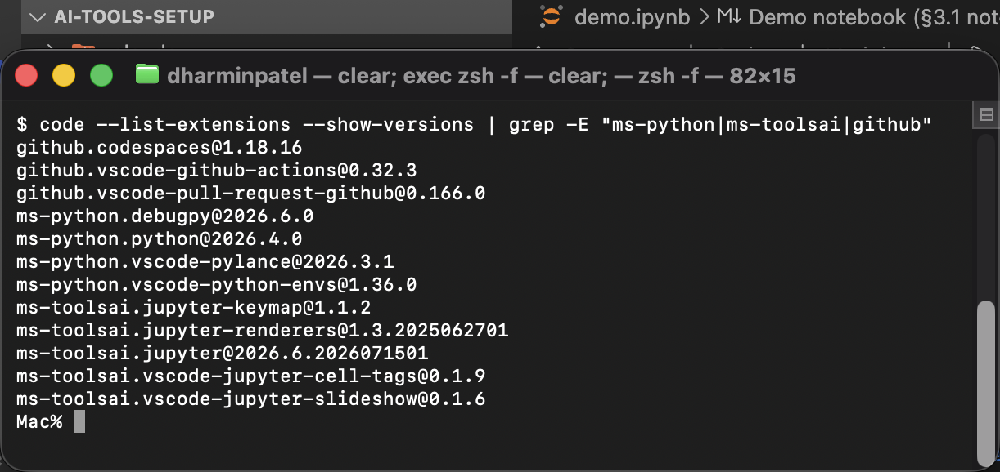
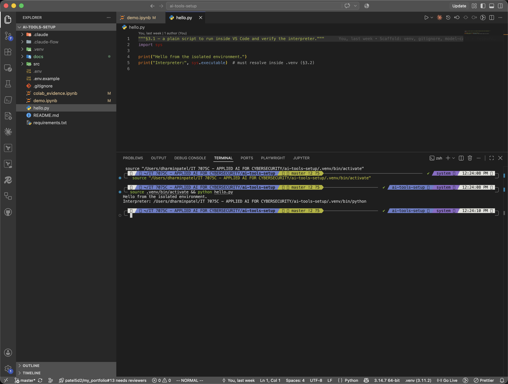
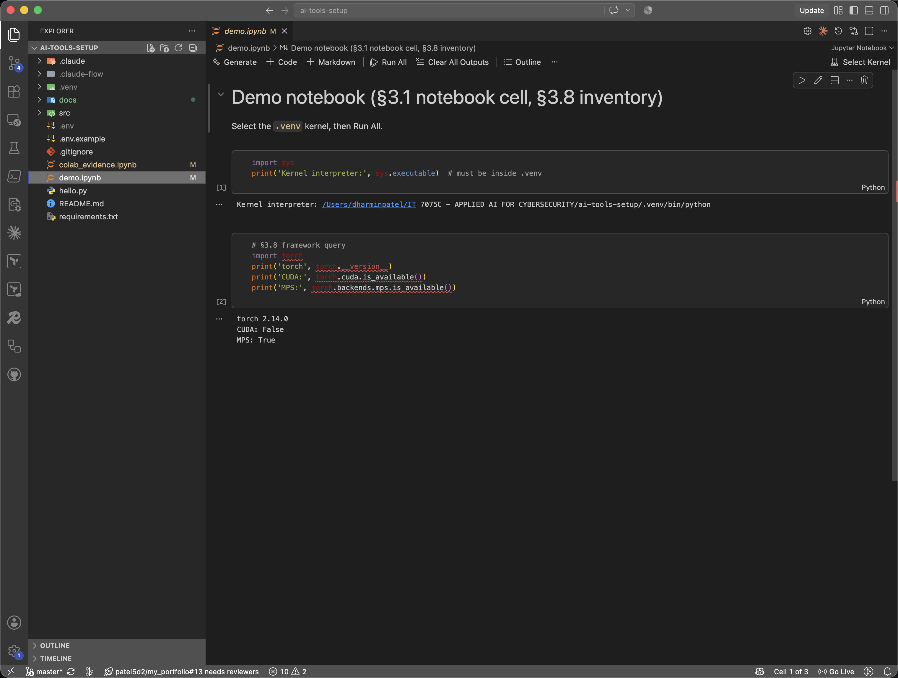

---

## §3.2 — Isolated Python environments (10 pts)

The environment is a standard `venv` at `.venv/` in the project root, built on the Python 3.11
framework build rather than the Homebrew 3.14 interpreter — PyTorch does not yet publish wheels
for 3.14, and `torch` is required by §3.8.

**Commands issued:**

```
$ /Library/Frameworks/Python.framework/Versions/3.11/bin/python3.11 -m venv .venv   # create
$ source .venv/bin/activate                                                          # activate
$ python -m pip install -r requirements.txt                                          # install deps
$ deactivate                                                                         # deactivate
```

**Verification — the interpreter resolves inside the environment, not the system install:**

```
$ python -V
Python 3.11.2

$ which python
/Users/dharminpatel/IT 7075C - APPLIED AI FOR CYBERSECURITY/ai-tools-setup/.venv/bin/python
```

Contrast with the deactivated shell, where `which python3` returns `/opt/homebrew/bin/python3`
(Python 3.14.7). The prefix difference is the proof of isolation.

**`requirements.txt`:**

```
python-dotenv
numpy
anthropic
openai
torch
ipykernel
notebook
```

**`pip list` (abridged — key packages):**

```
anthropic      1.4.0
ipykernel      7.3.0
notebook       7.6.2
numpy          2.4.6
openai         3.11.0
python-dotenv  1.2.3
torch          2.14.0
```

The environment was registered as a named Jupyter kernel so it is selectable in the notebook
kernel picker as well as the interpreter picker:

```
$ python -m ipykernel install --user --name ai-tools-setup \
    --display-name "Python (.venv ai-tools-setup)"
Installed kernelspec ai-tools-setup in /Users/dharminpatel/Library/Jupyter/kernels/ai-tools-setup
```

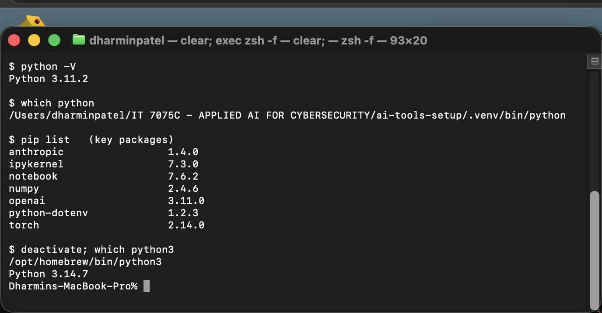
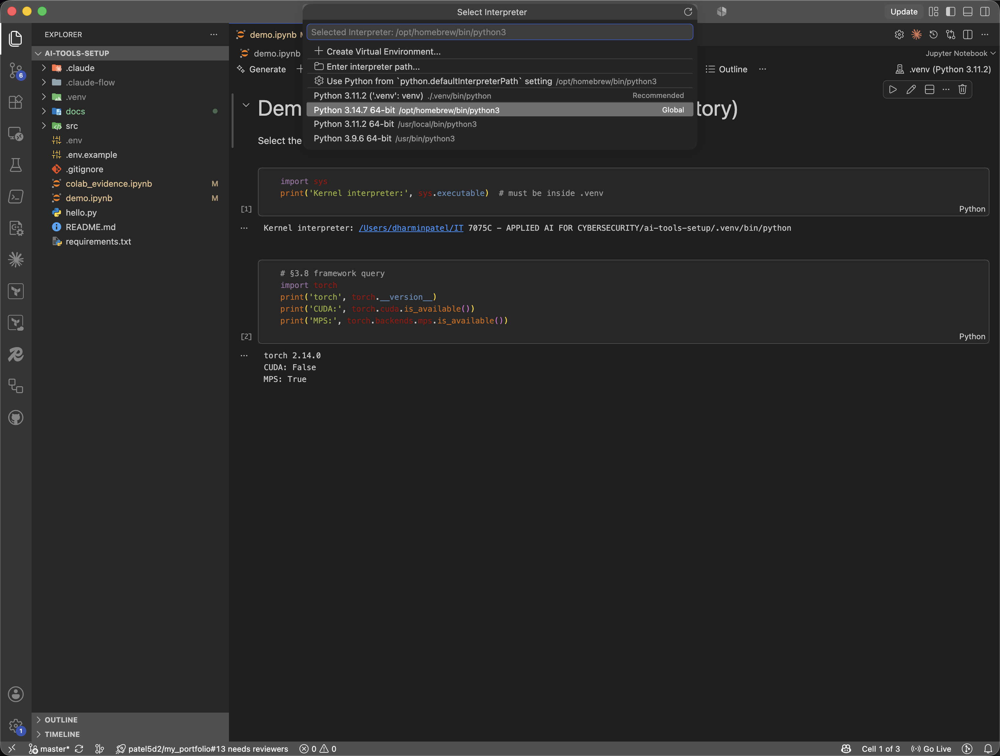
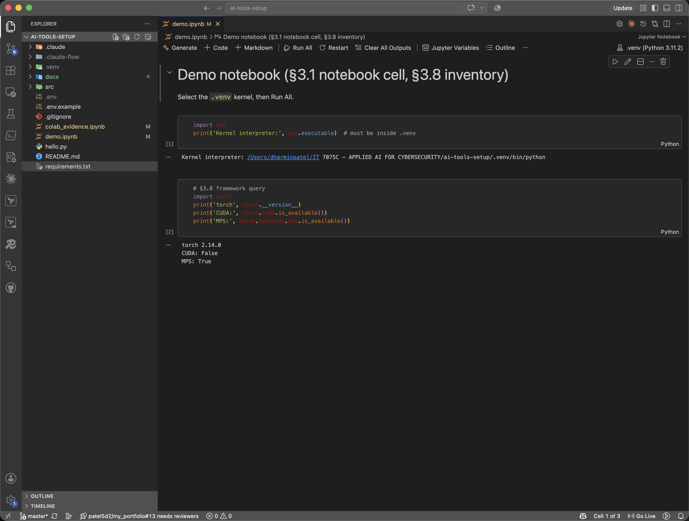

---

## §3.3 — Version control and remote repositories (10 pts)

**Repository:** https://github.com/patel5d2/ai-tools-setup (public)

**Local identity:**

```
$ git config --global user.name
Dhrm976
$ git config --global user.email
dharminp976@gmail.com
```

**Commit history** (more than the two required substantive commits):

```
$ git log --oneline
95f9d42 Rebuild venv at current path; pin model to claude-opus-5; add Colab evidence notebook
3629370 Remove outdated .DS_Store file
6c760c1 Update demo notebook: adjust execution counts and add torchvision version check
...
6432a49 Add numpy — torch needs it and it silences the MPS-init warning
8dd37de Scaffold: venv, gitignore, model-call + resource-inventory scripts
```

**Credential and environment exclusion — `.gitignore`:**

```
# Secrets — never commit (§3.3, §3.5)
.env

# Virtual environment (§3.2, §3.3)
.venv/

# Python
__pycache__/
*.pyc
.ipynb_checkpoints/

# macOS / tooling noise
.DS_Store
.claude-flow/
```

**Proof the exclusion works.** A real `.env` containing a live API key exists in the working
directory, yet `git status` is clean and does not list it:

```
$ ls -l .env
-rw-r--r--  1 dharminpatel  127 Sep  4 13:46 .env

$ git status --short
                       (no output — working tree clean)

$ git ls-files | grep -c '^\.env$'
0
```

`.env.example` **is** committed, carrying the variable names but placeholder values, so the
repository documents what is required without disclosing anything:

```
# Copy to .env and fill in. .env is gitignored — never commit real keys (§3.5).
ANTHROPIC_API_KEY=sk-ant-...
OPENAI_API_KEY=sk-...
```

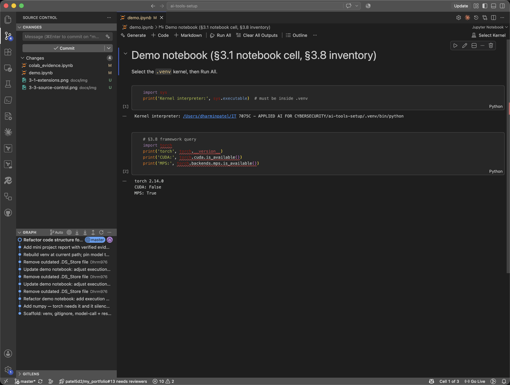
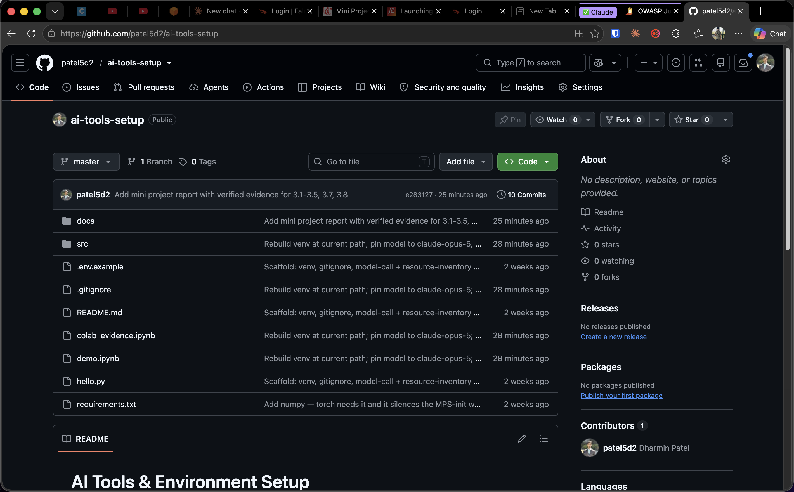
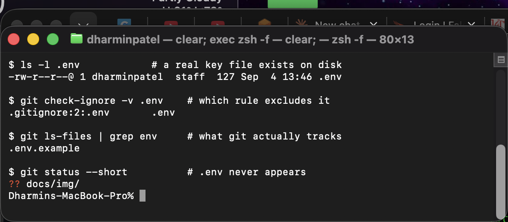

---

## §3.4 — Hosted notebooks and persistent storage (10 pts)

Notebook: `colab_evidence.ipynb`, executed in Google Colab.

Google Drive is mounted at `/content/drive`, a file is written beneath `MyDrive`, the runtime is
then restarted, and the file is read back after the runtime reconnects:

```python
from google.colab import drive
drive.mount('/content/drive')

from pathlib import Path
import datetime
p = Path('/content/drive/MyDrive/IT7075C/persistence.txt')
p.parent.mkdir(parents=True, exist_ok=True)
p.write_text(f'written before restart at {datetime.datetime.now()}\n')
```

After **Runtime ▸ Restart session**, the runtime is a fresh virtual machine — `/content` is empty
— but Drive is durable storage outside it, so remounting recovers the file:

```python
drive.mount('/content/drive')
p = Path('/content/drive/MyDrive/IT7075C/persistence.txt')
print('survived restart:', p.exists())
print(p.read_text())
```

This is the point of the competency: Colab's local filesystem is ephemeral and disappears with
the runtime, so anything that must outlive a session has to be written to mounted Drive.


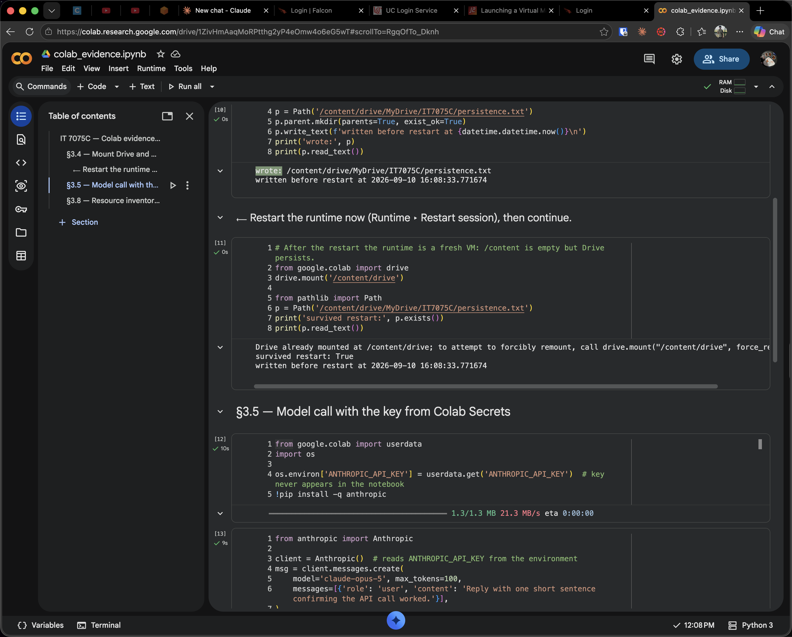


---

## §3.5 — Programmatic model access with managed credentials (12 pts)

Provider: **Anthropic**, model `claude-opus-5`.

The same source pattern works in both environments because both supply the key through the
process environment — only the *source* of that environment variable differs.

**Credential-loading code** (`src/model_test.py`):

```python
import os
from dotenv import load_dotenv

load_dotenv()          # local: reads .env. In Colab this is a no-op.
                       # Colab: the key is injected into os.environ from Secrets instead.

from anthropic import Anthropic
client = Anthropic()   # reads ANTHROPIC_API_KEY from the environment
model = os.getenv("MODEL", "claude-opus-5")
msg = client.messages.create(
    model=model, max_tokens=100,
    messages=[{"role": "user", "content": PROMPT}],
)
print(f"[Anthropic {model}] {msg.content[0].text}")
```

No key is ever a literal in the source. `Anthropic()` is constructed with no arguments and the
SDK resolves `ANTHROPIC_API_KEY` from the environment itself.

**Local environment — key from `.env` (gitignored):**

```
$ python src/model_test.py
[Anthropic claude-opus-5] API call successful — everything's working as expected.
```

**Colab environment — key from the Secrets panel:**

```python
from google.colab import userdata
import os
os.environ['ANTHROPIC_API_KEY'] = userdata.get('ANTHROPIC_API_KEY')
```

The key is stored in Colab's **🔑 Secrets** sidebar with *Notebook access* enabled. It is held
against the Google account, not inside the notebook, so the notebook can be shared or committed
without leaking the credential — the Colab analogue of `.env` plus `.gitignore`.

> All screenshots below are cropped or redacted so no key material is visible. The Secrets panel
> is captured with the value hidden (the eye toggle left off).

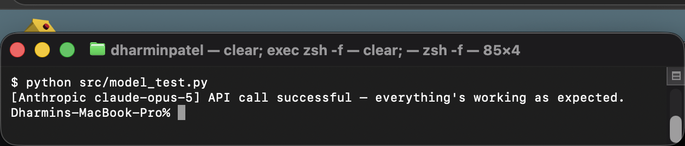
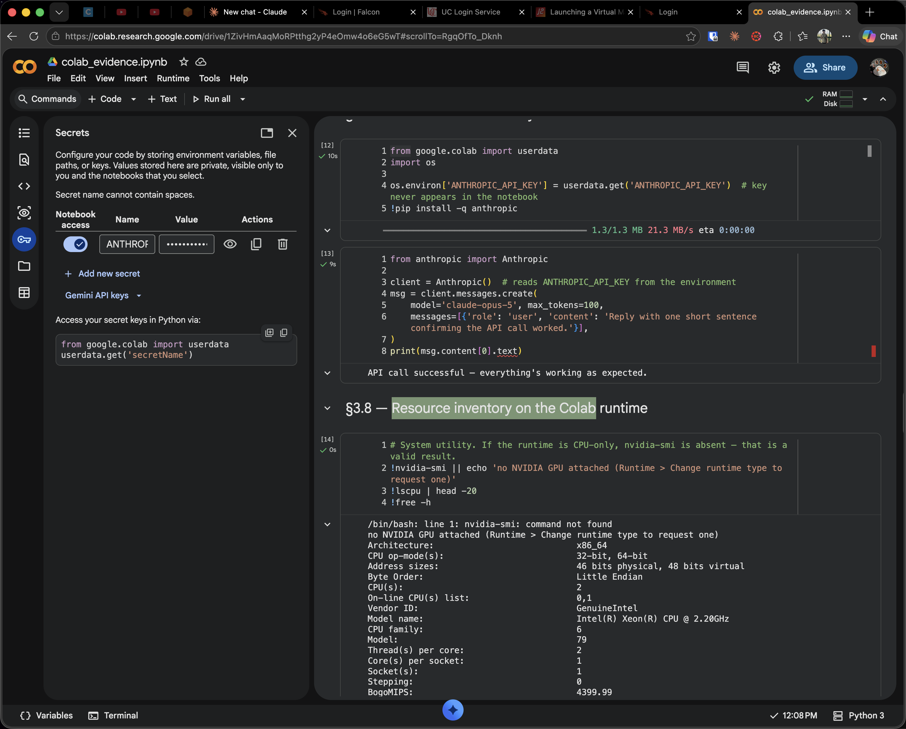
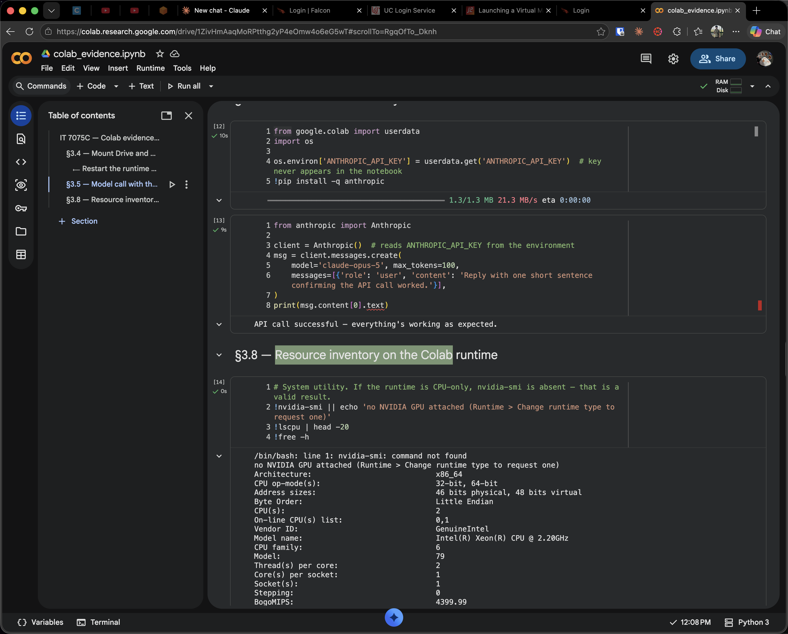

---

## §3.6 — Cloud virtual machine deployment on Jetstream2

Not attempted — announced as unavailable. Under the stated contingency the ten points are
redistributed across the remaining competencies.

---

## §3.7 — Virtualization and isolated targets (12 pts)

**Platform: Docker Desktop. Target: OWASP Juice Shop.**

**Why a container rather than Metasploitable2.** This machine is Apple Silicon (arm64).
VirtualBox has no arm64 host build, and Metasploitable2 ships only as a 32-bit x86 image, so it
cannot be virtualized here without full CPU emulation. The assignment's stated alternative for
exactly this case is a containerized target, so OWASP Juice Shop was deployed instead.

**Network configuration — user-defined bridge, NAT, loopback-bound publish:**

```
$ docker network inspect pentest-lab \
    --format 'driver={{.Driver}} subnet={{range .IPAM.Config}}{{.Subnet}} gw={{.Gateway}}{{end}}'
driver=bridge subnet=172.28.0.0/16 gw=172.28.0.1

$ docker run -d --name juice-shop --network pentest-lab \
    -p 127.0.0.1:3000:3000 bkimminich/juice-shop
```

**Justification of the network mode.** A user-defined bridge network in NAT mode was chosen over
host networking for three reasons:

1. **The target is deliberately vulnerable.** On a bridge it has no address on the physical LAN,
   so nothing outside this machine can route to it. Host networking would place it directly on
   the host's interfaces and expose it to the local network.
2. **The publish is bound to `127.0.0.1`, not `0.0.0.0`.** The default `-p 3000:3000` listens on
   every host interface, including Wi-Fi. Binding the loopback address explicitly means only
   this machine can reach the service — the smallest exposure that still permits host-to-guest
   testing.
3. **A user-defined bridge gives container-name DNS**, so lab hosts address each other by name
   (`juice-shop`) rather than by an address that changes on restart. The default bridge does not
   provide this.

Host-only networking was not selected because Docker Desktop on macOS has no equivalent mode; a
loopback-bound bridge achieves the same containment goal.

**Running guest:**

```
$ docker ps
NAMES        IMAGE                   STATUS         PORTS
juice-shop   bkimminich/juice-shop   Up 6 seconds   127.0.0.1:3000->3000/tcp
```

**Reachability — service reached from the host:**

```
$ nc -zv 127.0.0.1 3000
localhost [127.0.0.1] 3000 (hbci) open

$ curl -sI http://127.0.0.1:3000
HTTP/1.1 200 OK
X-Content-Type-Options: nosniff
X-Frame-Options: SAMEORIGIN
X-Recruiting: /#/jobs

$ curl -s http://127.0.0.1:3000 | grep -io '<title>.*</title>'
<title>OWASP Juice Shop</title>
```

**Reachability — ICMP on the lab network:**

```
$ docker run --rm --network pentest-lab busybox ping -c 3 juice-shop
PING juice-shop (172.28.0.2): 56 data bytes
64 bytes from 172.28.0.2: seq=0 ttl=64 time=0.855 ms
64 bytes from 172.28.0.2: seq=1 ttl=64 time=0.089 ms
64 bytes from 172.28.0.2: seq=2 ttl=64 time=0.134 ms

--- juice-shop ping statistics ---
3 packets transmitted, 3 packets received, 0% packet loss
```

**An honest note on the ping.** Pinging `172.28.0.2` *directly from macOS* fails with 100% packet
loss, and this is expected rather than a misconfiguration — see the problem log below. Layer-3
reachability is therefore demonstrated on the lab network itself, and host-to-guest reachability
is demonstrated at layer 4 and layer 7 through the published port, which is the path an attack
tool would actually use against this target.

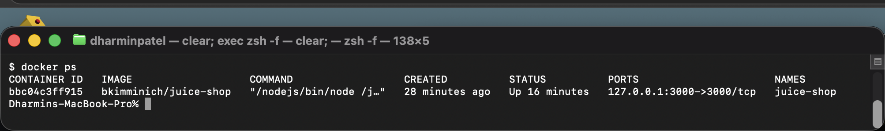
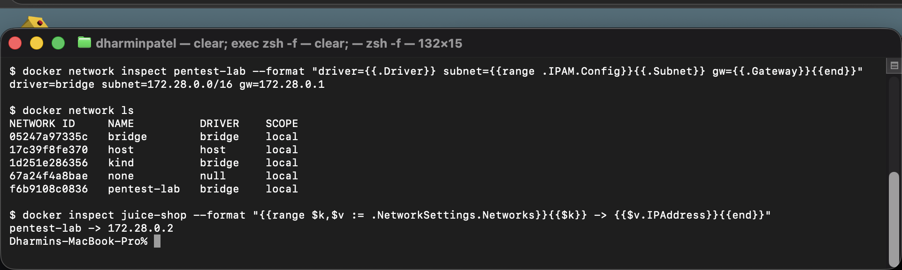
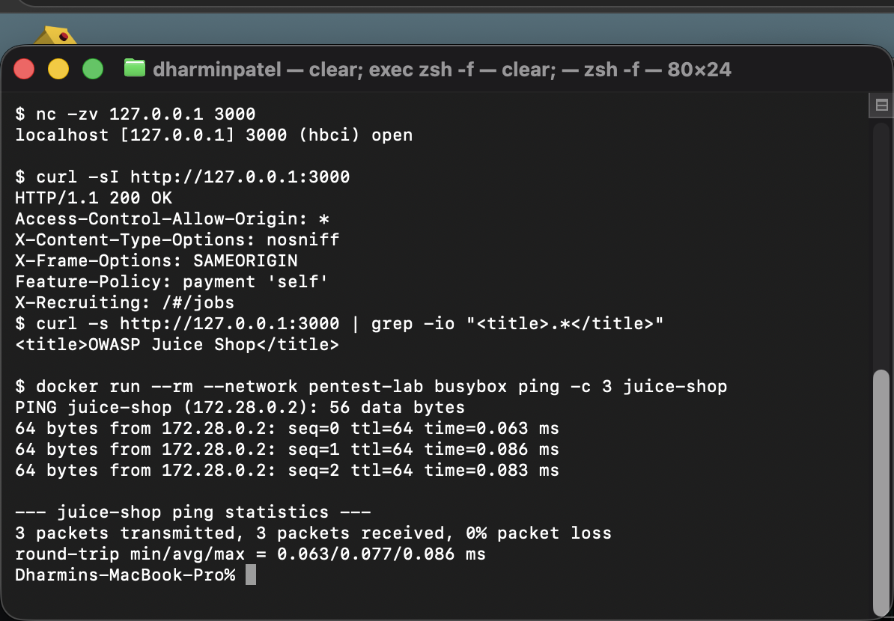
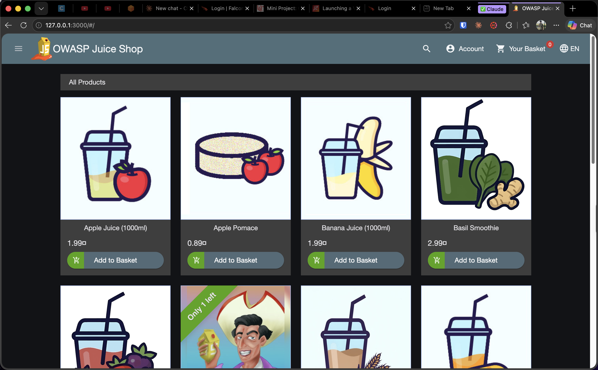

---

## §3.8 — Computational resource inventory (8 pts)

Collected by `src/resource_inventory.py`, which branches to the correct system utility for the
platform it is running on and then runs the same framework query everywhere.

### Local machine — MacBook Pro, Apple M2 Pro

*System utility* (`system_profiler SPHardwareDataType SPDisplaysDataType`, serial numbers cropped):

```
Model Name: MacBook Pro
Model Identifier: Mac14,10
Chip: Apple M2 Pro
Total Number of Cores: 12 (8 Performance and 4 Efficiency)
Memory: 16 GB

Apple M2 Pro:
  Chipset Model: Apple M2 Pro
  Type: GPU
  Bus: Built-In
  Total Number of Cores: 19
  Metal Support: Metal 4
```

*Framework query* (`torch`):

```
CPUs (os.cpu_count): 12
torch 2.14.0
CUDA available: False
MPS (Apple GPU) available: True
```

**Interpretation.** `CUDA available: False` is the correct and expected result: CUDA is NVIDIA's
API, and this machine has an Apple integrated GPU, not an NVIDIA discrete card. The GPU is
present and usable — through Metal, which PyTorch exposes as the MPS backend, reporting `True`.
Reading only the CUDA line would wrongly conclude "no GPU"; the 19 GPU cores are available for
acceleration, just through a different backend. Note also that memory is *unified*: the 16 GB is
shared between CPU and GPU rather than the GPU holding separate dedicated VRAM.

### Google Colab

*System utility:* `nvidia-smi`, plus `lscpu` and `free -h`.
*Framework query:* `torch.cuda.is_available()`.

Colab's answer depends on the runtime type selected under **Runtime ▸ Change runtime type**. On a
CPU-only runtime `nvidia-smi` is absent and `torch.cuda.is_available()` returns `False`; on a
GPU runtime `nvidia-smi` reports the attached accelerator and CUDA is available. The runtime used
for this evidence is recorded in the screenshot below.

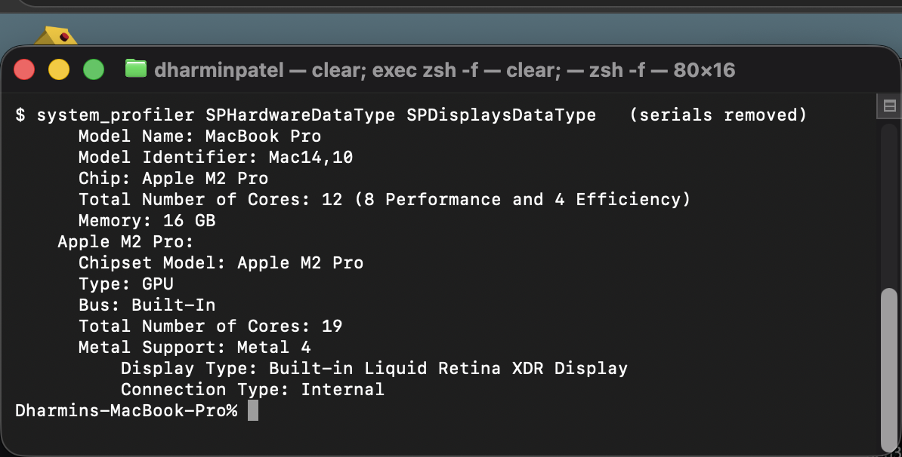
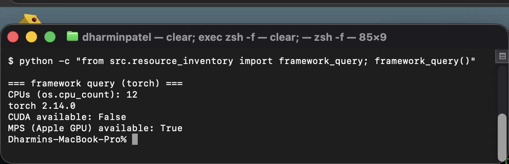
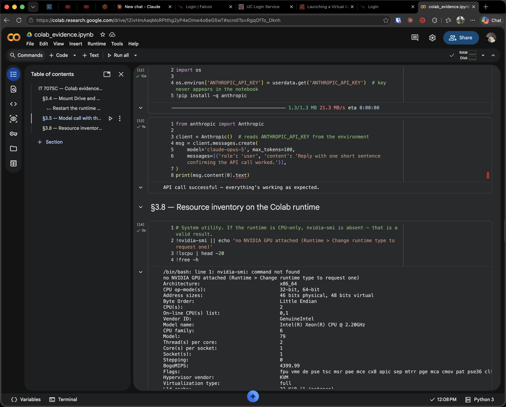
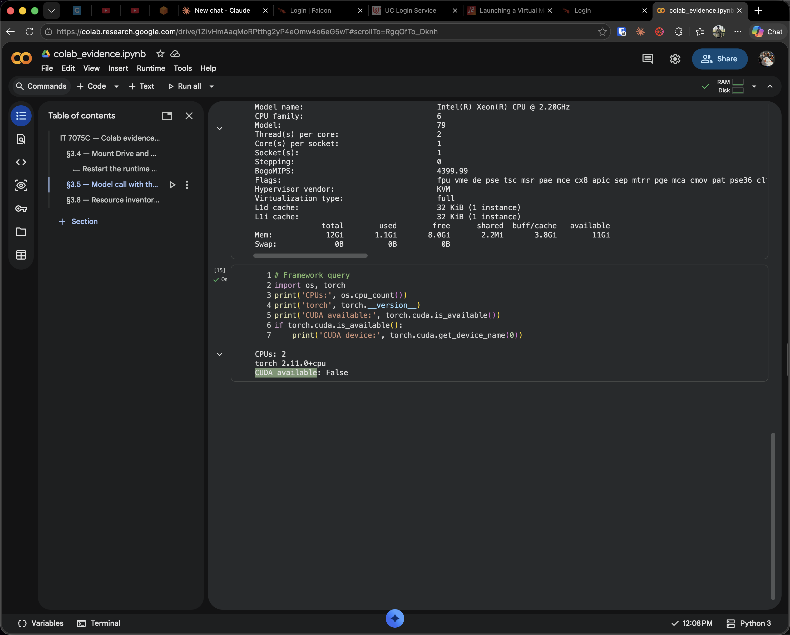

---

## §3.9 — Recorded technical demonstration (12 pts)

**Link:** `<PASTE UNLISTED YOUTUBE / DRIVE LINK HERE>` (also on page 1)

Running order used in the recording:

| # | Segment | Shows |
|---|---|---|
| 1 | Project open in VS Code Insiders; Extensions view | §3.1 |
| 2 | Activate venv; `python -V`, `which python`; interpreter and kernel pickers | §3.2 |
| 3 | Edit a file, commit and push from the Source Control panel; `ls -l .env` beside a clean `git status` | §3.3 |
| 4 | Colab: mount Drive, write file, restart runtime, read it back | §3.4 |
| 5 | `python src/model_test.py` locally; the same call in Colab from Secrets | §3.5 |
| 6 | `docker ps`, network inspect, `curl` and `ping`, Juice Shop in the browser | §3.7 |
| 7 | `resource_inventory.py` locally and in Colab | §3.8 |

---

## Problems encountered and resolutions

**1. The virtual environment silently stopped working after the project was moved.**
Activating `.venv` succeeded without complaint, but the very next command failed with
`command not found: python`. The cause was in `.venv/pyvenv.cfg`, which recorded
`command = ... -m venv /Users/dharminpatel/ai-tools-setup/.venv` — the environment had been
created at an earlier location, and the project directory had since been moved twice. A venv
stores absolute paths in its activation script and interpreter symlinks, so it does not survive
being relocated. The fix was to discard and rebuild it in place
(`rm -rf .venv && python3.11 -m venv .venv && pip install -r requirements.txt`), which is the
correct response rather than a workaround: a virtual environment is disposable by design, and
`requirements.txt` exists precisely so it can be reconstructed. This is also the strongest
argument for `.venv/` being in `.gitignore` — the directory is not portable, so committing it
would ship something broken to any other machine.

**2. Choosing an interpreter version: newest is not always usable.** The Homebrew default is
Python 3.14.7, but building the environment on it fails because PyTorch has not yet published
3.14 wheels, and `torch` is required for the §3.8 framework query. The environment was therefore
built deliberately on the Python 3.11 framework build. The lesson is that the constraint flows
from the dependencies, not from the interpreter — the isolated environment is what makes holding
an older Python for this project harmless to everything else on the machine.

**3. Host-to-guest `ping` fails on Docker Desktop for macOS, and it is not a misconfiguration.**
`ping 172.28.0.2` from macOS returned 100% packet loss even though the container was healthy and
its web service answered normally. Docker on macOS does not run containers on the host kernel; it
runs them inside a Linux virtual machine, and `172.28.0.0/16` exists only inside that VM's
network namespace. macOS has no route to it, so ICMP has nowhere to go, while TCP still works
because Docker's userland proxy forwards the published port across the VM boundary. The diagnosis
was confirmed by pinging the same container successfully from a second container attached to the
same bridge. The resolution was to demonstrate ICMP where it is meaningful — on the lab network —
and host-to-guest reachability at layer 4 and layer 7 via the published port. Time was lost here
treating a platform boundary as a configuration error; checking the platform's architecture first
would have been quicker than re-checking the network settings.

---

## One decision that would be made differently

**The `.env` file would have been created from `.env.example` on day one, before any code was
written.** The safe pattern was adopted early enough that no key was ever committed, but the
ordering was luck as much as design: the ignore rule and the example file were added alongside
the first real credential rather than ahead of it. The correct discipline is to commit
`.gitignore` and `.env.example` in the very first commit, so the repository is incapable of
accepting a secret before one exists to leak — with `git rm --cached` and a rewritten history
being the only remedy afterwards, and a rotated key the only safe assumption. A second, smaller
change: the environment would be pinned with `pip freeze > requirements.txt` rather than left as
bare package names, so the exact versions in this report are reproducible instead of drifting to
whatever is current at the next install.
